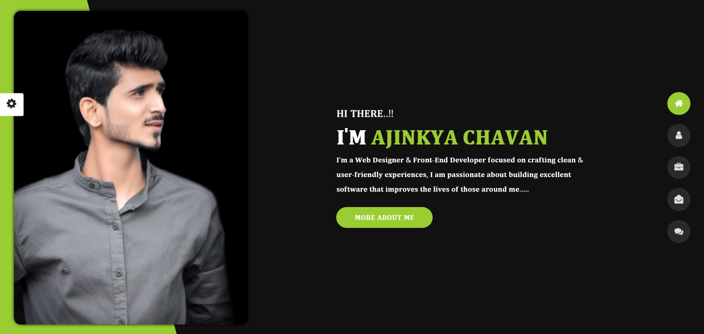
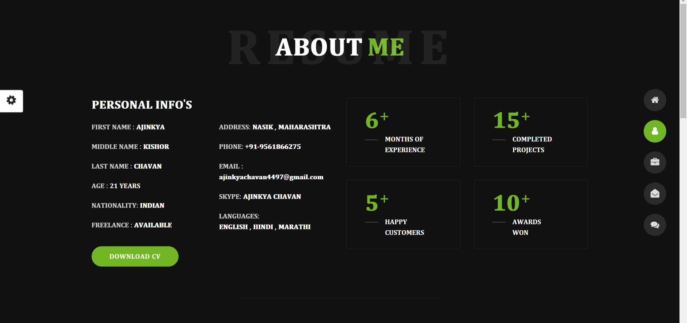
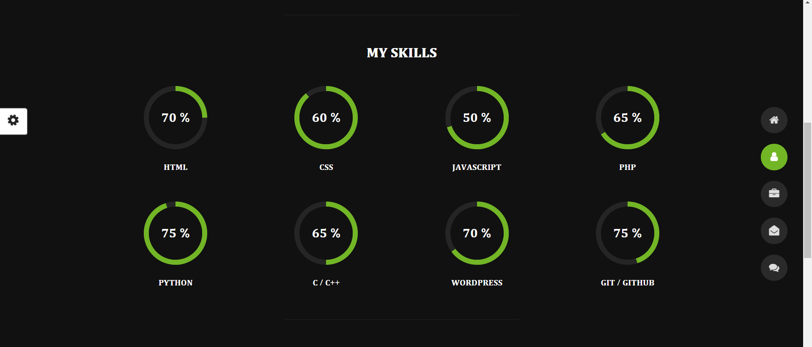
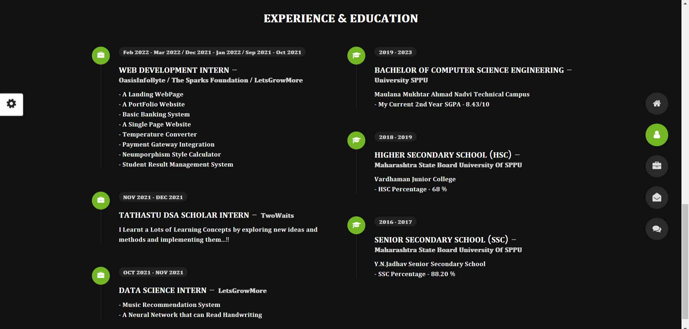
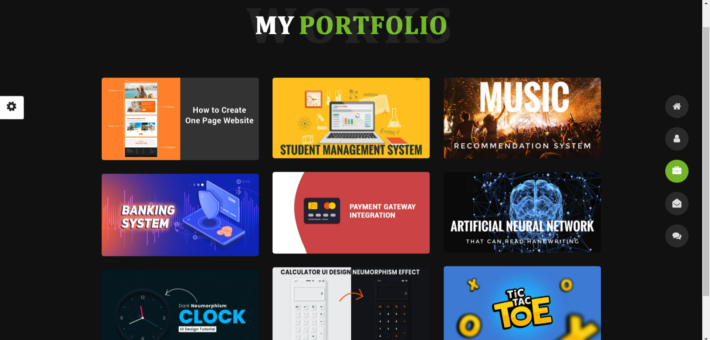
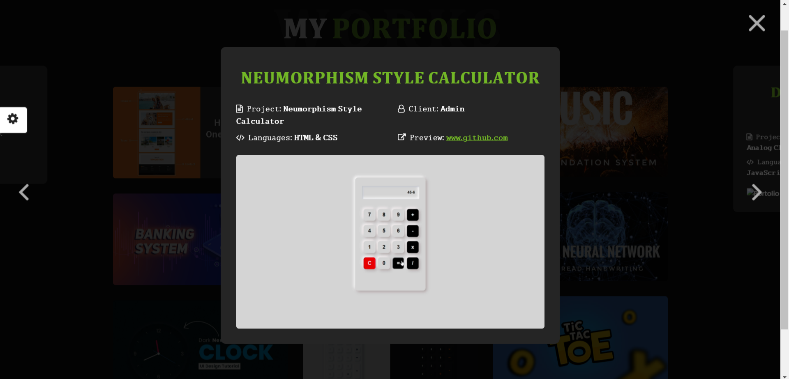
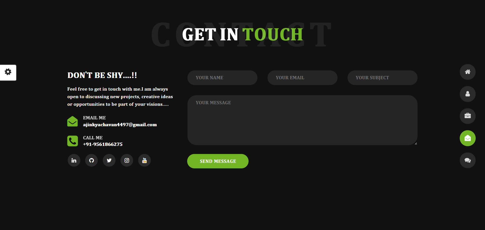
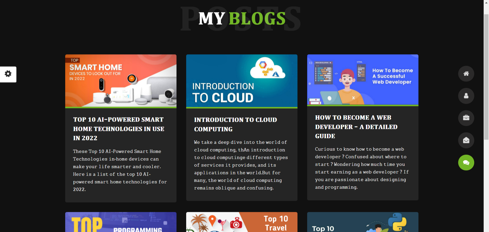
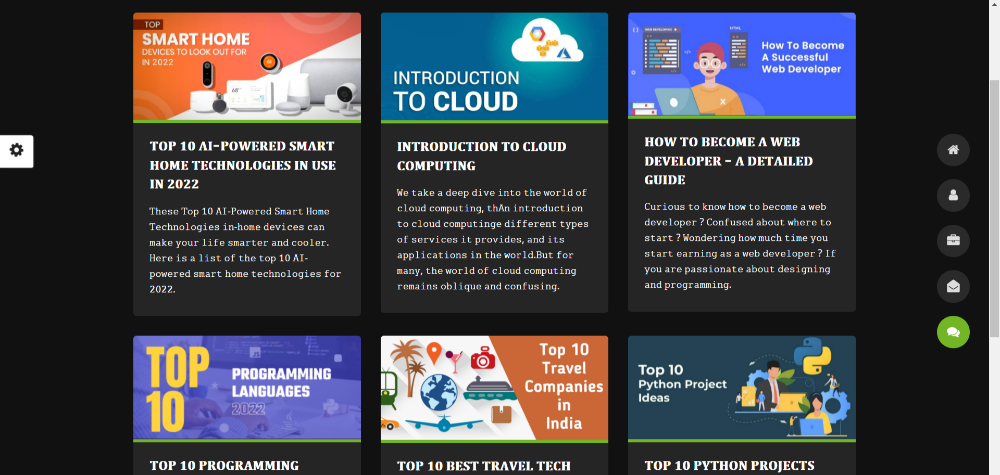

# Personal-PortFolio

# Portfolio Responsive Complete

### Portfolio responsive complete
A clean and nice web portfolio for designer or developer. That includes almost everything you want to show. At first, your name, links to social networks and a great image. Then the About section displays more information about you. Then the list of Skills it offers. It also has a section where it shows some recent work. And at the bottom it has a form, and at the end with a footer.

                                                      𝐏𝐎𝐑𝐓𝐅𝐎𝐋𝐈𝐎 𝐏𝐀𝐆𝐄 𝐏𝐑𝐄𝐕𝐈𝐄𝐖

                                                      𝐀𝐁𝐎𝐔𝐓 𝐏𝐀𝐆𝐄 𝐏𝐑𝐄𝐕𝐈𝐄𝐖

                                                      𝐒𝐊𝐈𝐋𝐋𝐒 𝐏𝐀𝐆𝐄 𝐏𝐑𝐄𝐕𝐈𝐄𝐖

                                                     𝐄𝐗𝐏𝐄𝐑𝐈𝐄𝐍𝐂𝐄 & 𝐄𝐃𝐔𝐂𝐀𝐓𝐈𝐎𝐍 𝐏𝐀𝐆𝐄 𝐏𝐑𝐄𝐕𝐈𝐄𝐖

                                                      𝐏𝐎𝐑𝐓𝐅𝐎𝐋𝐈𝐎 𝐏𝐑𝐎𝐉𝐄𝐂𝐓𝐒 𝐏𝐑𝐄𝐕𝐈𝐄𝐖

                                                      𝐂𝐀𝐋𝐂𝐔𝐋𝐀𝐓𝐎𝐑 𝐏𝐑𝐎𝐉𝐄𝐂𝐓 𝐏𝐀𝐆𝐄 𝐏𝐑𝐄𝐕𝐈𝐄𝐖

                                                        𝐂𝐎𝐍𝐓𝐀𝐂𝐓 𝐏𝐀𝐆𝐄 𝐏𝐑𝐄𝐕𝐈𝐄𝐖

                                                            𝐁𝐋𝐎𝐆𝐒 𝐏𝐀𝐆𝐄 𝐏𝐑𝐄𝐕𝐈𝐄𝐖
                                                                               
                                                                               
                                                                               
                                                            𝐕𝐀𝐑𝐈𝐎𝐔𝐒 𝐃𝐈𝐅𝐅𝐄𝐑𝐄𝐍𝐓 𝐁𝐋𝐎𝐆𝐒
